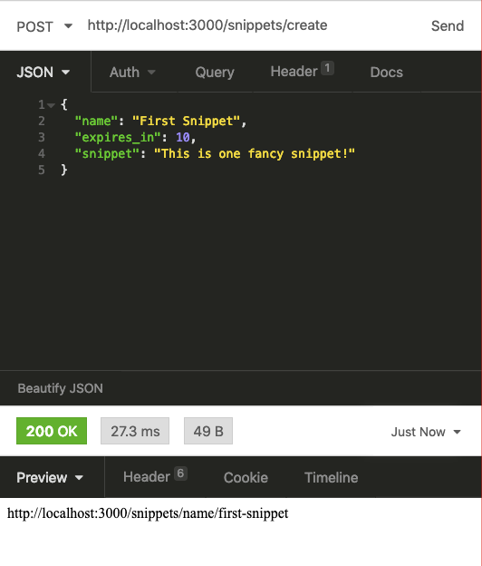
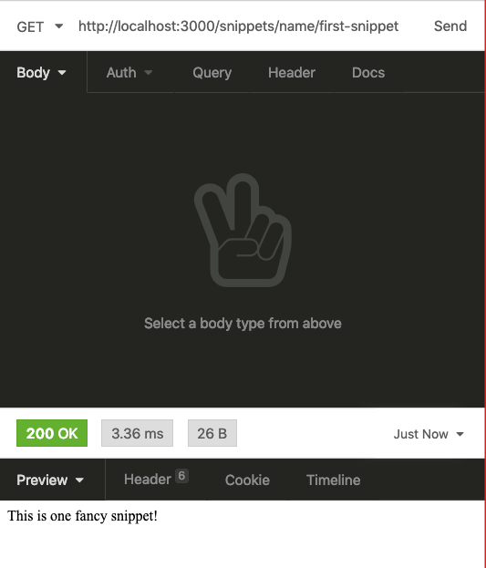
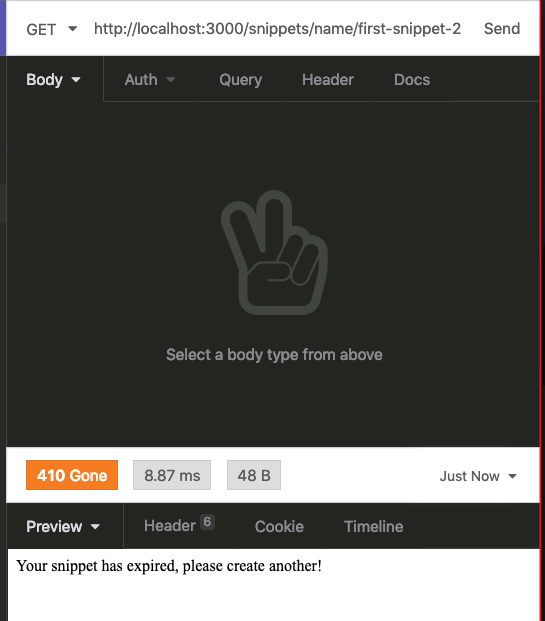

# Stellar

## Libraries

- `ramda`, `ramda-adjunct`, and `lodash` are included for general utility functions.
- `fp-ts` is strictly included for it's eager `pipe` implementation that I'm using [in place of the pipeline operator](https://developer.mozilla.org/en-US/docs/Web/JavaScript/Reference/Operators/Pipeline_operator).
- `express` for a simple HTTP server
- `short-uuid`: Short UUIDs https://www.npmjs.com/package/short-uuid
- `lowdb` is a simple file db useful for POCs
- `date-fns` for a reliable unix timestamp that I've used in the past.

## Notes

- I would have wrapped all the db functions into a library file so the data layer could be swapped out to something more robust later, but ran out of time.
- The prompt said to "extend by 30 seconds each time it is accessed" so I added to the `snippet.eat` instead of making it 30 seconds from the time accessed.

## Screen Shots

### Created Snippet

### Retrieved Snippet

### Expired Snippet

